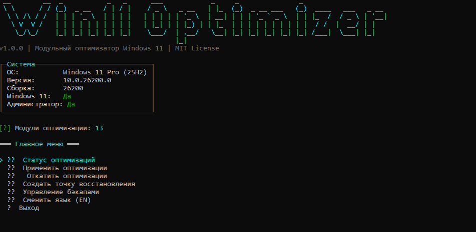

<div align="center">

# 🚀 Win11Optimizer

[](https://opensource.org/licenses/MIT)
[](https://dotnet.microsoft.com/)
[](https://www.microsoft.com/windows)

[🇷🇺 Русский (Russian)](#-русский) | [🇬🇧 English](#-english)



</div>

---

## 🇷🇺 Русский

**Win11Optimizer** — это модульная, высокопроизводительная CLI-утилита для хардкорной оптимизации Windows 11. Инструмент написан на C# / .NET 8 и направлен на максимальное повышение FPS и отзывчивости системы, особенно на процессорах AMD Ryzen.

### ✨ Особенности
- 🎨 **Интерфейс Spectre.Console**: Красивый, интерактивный CLI интерфейс.
- 🌐 **Мультиязычность**: Поддержка Русского и Английского (переключение прямо в меню).
- ⚙️ **Auto-Discovery**: Утилита автоматически находит и подключает новые модули оптимизации через Рефлексию.
- 💾 **Надежные бэкапы (IStateStorage)**: Сохраняет старые параметры (службы, схемы питания) в `%LOCALAPPDATA%\Win11Optimizer\state.json` и автоматически создаёт **Точки Восстановления Windows**.
- ⚡ **SingleFile & ReadyToRun**: Быстрый запуск и работа из одного портативного `.exe` файла.

### 🛠️ Основные Модули Оптимизации (Твики)
1. **Disable VBS & Memory Integrity**: Полное отключение изоляции ядра и VBS (Виртуализации). Добавляет 5-15% FPS на AMD Ryzen.
2. **AMD Gaming (ULPS Disable)**: Отключает сверхнизкое энергопотребление (ULPS) для видеокарт Radeon, убирая статтеры и микрофризы.
3. **Process & Memory Optimization**: Фокус мощности ЦП на активном окне игры (Win32PrioritySeparation) и отключение кэша LargeSystemCache.
4. **Ultimate Power Plan**: Включает скрытую схему "Максимальная производительность", выключает парковку ядер процессора (Core Parking) и засыпание USB.
5. **Aggressive Services Disable**: Хардкорное отключение лишних служб Windows. Легко возвращается обратно с помощью встроенной системы бэкапов.

### 🚀 Запуск и Сборка
**Требования:** Windows 11 (или 10), Права Администратора.

Скачайте готовый `exe` файл из папки [Release](Release/) или соберите самостоятельно:
```bash
dotnet publish src/Win11Optimization.CLI/Win11Optimization.CLI.csproj -c Release -r win-x64 --self-contained true -o Release
```

*Disclaimer: Автор не несет ответственности за стабильность вашей системы. Рекомендуется создавать Точку Восстановления перед применением твиков (встроено в программу).*

---

## 🇬🇧 English

**Win11Optimizer** is a modular, high-performance CLI utility for hardcore optimization of Windows 11. Built with C# / .NET 8, this tool is aimed at maximizing your FPS and system responsiveness, especially on AMD Ryzen processors.

### ✨ Features
- 🎨 **Spectre.Console Interface**: A beautiful, interactive command-line interface.
- 🌐 **Multilingual**: Supports English and Russian (can be switched instantly from the main menu).
- ⚙️ **Auto-Discovery**: The utility automatically detects and registers new optimization modules using Reflection.
- 💾 **Reliable Backups (IStateStorage)**: Saves original system states (services, power plans) to `%LOCALAPPDATA%\Win11Optimizer\state.json` and automatically creates **System Restore Points**.
- ⚡ **SingleFile & ReadyToRun**: Fast startup and portable execution from a single `.exe` file.

### 🛠️ Core Optimization Modules (Tweaks)
1. **Disable VBS & Memory Integrity**: Completely disables Core Isolation and VBS. Provides a 5-15% FPS boost on AMD Ryzen.
2. **AMD Gaming (ULPS Disable)**: Disables Ultra Low Power State (ULPS) for Radeon GPUs, removing micro-stutters.
3. **Process & Memory Optimization**: Forces CPU focus on the active game window and disables LargeSystemCache.
4. **Ultimate Power Plan**: Unlocks the "Ultimate Performance" plan, completely disables Core Parking, and disables USB selective suspend.
5. **Aggressive Services Disable**: Hardcore disabling of unnecessary Windows bloatware services. Easily reversible using the built-in state rollback system.

### 🚀 Running and Building
**Requirements:** Windows 11 (or 10), Administrator privileges.

Download the ready-to-use `exe` from the [Release](Release/) folder, or build it yourself:
```bash
dotnet publish src/Win11Optimization.CLI/Win11Optimization.CLI.csproj -c Release -r win-x64 --self-contained true -o Release
```

*Disclaimer: The author is not responsible for the stability of your system. It is highly recommended to create a System Restore point before applying tweaks (built into the app).*
